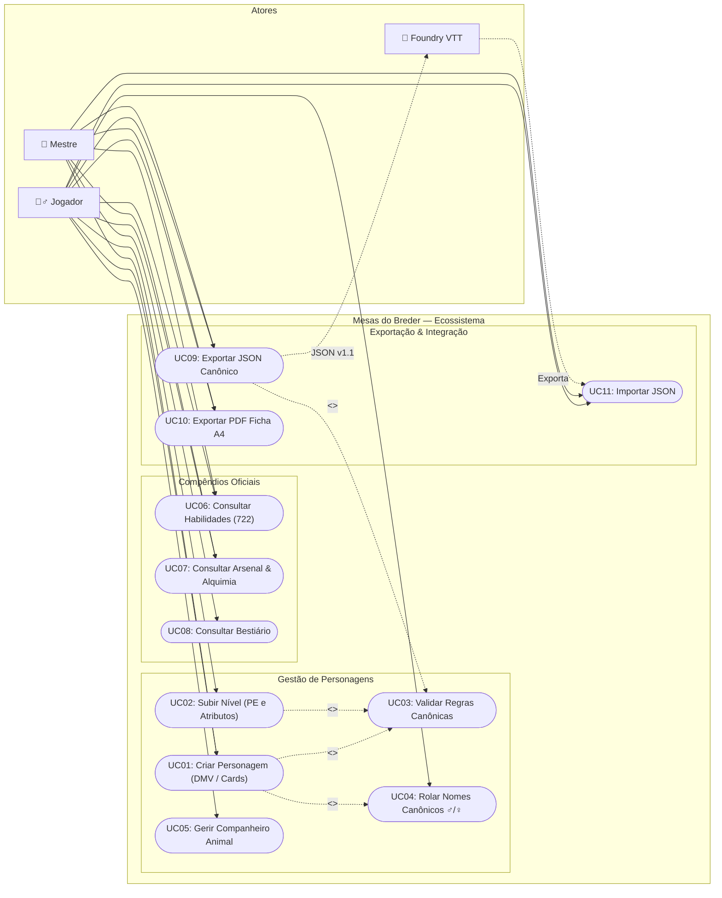
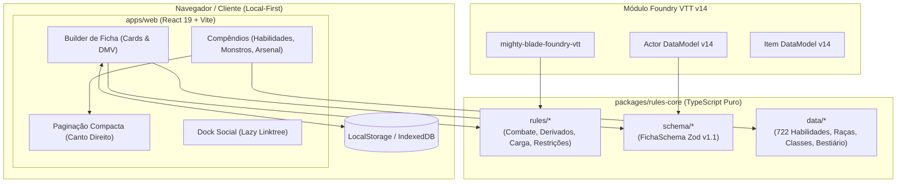
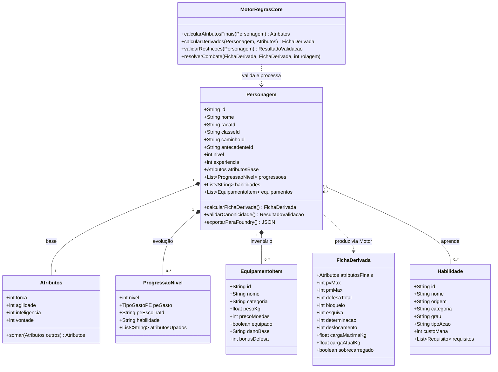
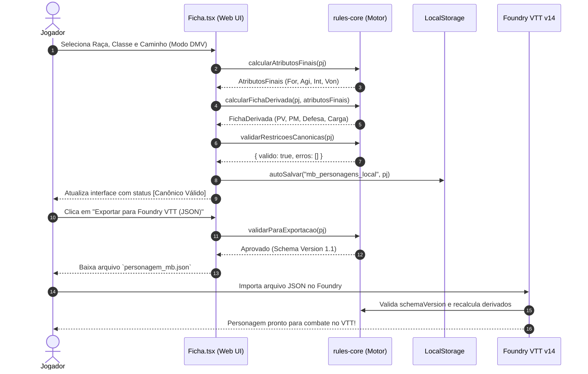

# 🏛️ Especificação de Requisitos de Software & Engenharia de Sistemas (UML)
### Ecossistema Mesas do Breder — Mighty Blade 3ª Edição & Foundry VTT v14

---

## 📑 Sumário Executivo
Este documento formaliza a **Engenharia de Requisitos** e o **Modelamento Arquitetural (UML)** do ecossistema de software **Mesas do Breder**, englobando:
1. **Aplicação Web (SPA):** Interface reativa de alta performance para jogadores e mestres (criação de fichas, compêndios e utilitários táticos).
2. **Motor de Regras Compartilhado (`@mighty-blade/rules-core`):** Biblioteca determinística e agnóstica de plataforma com 100% de cobertura canônica das regras do manual v3.5.
3. **Módulo Foundry VTT v14 (`mighty-blade-foundry-vtt`):** Implementação nativa sobre o paradigma `TypeDataModel` para mesas virtuais.

---

## 1. 👥 Atores do Sistema

| Ator | Descrição |
| :--- | :--- |
| **Jogador (Player)** | Usuário final focado em criar personagens, acompanhar progresso (XP/nível), consultar habilidades/equipamentos e exportar fichas para o Foundry VTT ou impressão A4. |
| **Mestre de Jogo (GM / Storyteller)** | Usuário que gerencia campanhas, consulta fichas de monstros, ameaças, regras de alquimia/crafting e realiza testes de combate. |
| **Foundry VTT (Sistema Externo)** | Plataforma de VTT que consome o contrato de dados JSON canônico (schema v1.1) para instanciar atores, itens e rolagens automatizadas. |

---

## 2. 📋 Engenharia de Requisitos

### 2.1 Requisitos Funcionais (RF)

| ID | Requisito | Prioridade | Descrição / Regra de Negócio |
| :--- | :--- | :--- | :--- |
| **RF01** | **Criação de Personagem Multi-Modo** | **MUST** | Permitir ao jogador criar fichas de nível 1 nos modos **Cards Detalhados** (lore visual) ou **Compacto DMV** (dropdowns rápidos estilo DMV/Nitsoa com preview em modal). |
| **RF02** | **Cálculo Canônico de Atributos** | **MUST** | Calcular automaticamente os 4 atributos (Força, Agilidade, Inteligência, Vontade) somando: base racial + bônus de classe + habilidades raciais (ex: Adaptabilidade Humana) + débitos de antecedentes. |
| **RF03** | **Cálculo de Estatísticas Derivadas** | **MUST** | Calcular em tempo real: PV Máximo, PM Máximo, Defesa Total (8 + Agilidade + bônus de itens), Bloqueio, Esquiva, Determinação, Deslocamento e Capacidade de Carga. |
| **RF04** | **Validação Canônica de Regras** | **MUST** | Bloquear combinações ilegais de acordo com o manual v3.5 (ex: Classe incompatível com Caminho, armas pesadas sem força mínima, excesso de pontos). |
| **RF05** | **Progressão de Nível (Níveis 1 a 20)** | **MUST** | Permitir evolução de nível gerenciando alocação obrigatória de Habilidade nova, gasto de Ponto de Evolução (PE) e +1 em 2 atributos nos níveis 4, 7, 10 e 16. |
| **RF06** | **Compêndio Oficial de Habilidades (722)** | **MUST** | Catálogo completo de técnicas, magias, posturas e características com busca textual, filtros por origem/categoria/grau/tipo e paginação no canto inferior direito. |
| **RF07** | **Compêndio do Bestiário & Monstros** | **MUST** | Catálogo tático de criaturas por ameaça (Fácil, Média, Difícil, Chefe) e tipo, com visualização em Cards e Tabela Tática. |
| **RF08** | **Compêndio do Arsenal & Alquimia** | **MUST** | Tabela de armas, armaduras, escudos, kits de aventureiro e receitas/ingredientes de poções alquímicas com cálculo de CD de preparo. |
| **RF09** | **Exportação para Foundry VTT (JSON v1.1)** | **MUST** | Gerar arquivo JSON canônico estritamente compatível com o schema v1.1 para importação direta no Foundry VTT v14. |
| **RF10** | **Exportação de Ficha Clássica em PDF A4** | **SHOULD** | Gerar PDF diagramado pronto para impressão no formato da folha física tradicional de Mighty Blade. |
| **RF11** | **Gerador Canônico de Nomes (♂ / ♀)** | **SHOULD** | Botões com rolagem de dados gerando nomes específicos da raça e gênero escolhidos com base nas tabelas do livro de regras. |
| **RF12** | **Gerenciamento de Companheiro Animal** | **SHOULD** | Painel tático para animais de montaria/combate calculando PV, defesa, barda e capacidade de carga adicional. |
| **RF13** | **Simulador de Rolagens & Combate (2d6 / 3d6)** | **SHOULD** | Avaliação probabilística de rolagens com dados extras (3d6 escolhe os 2 maiores) e cálculo de margem de sucesso e dano. |
| **RF14** | **Dock Social Comunitário (Lazy Linktree)** | **COULD** | Barra elegante com 7 botões squircle para integração da comunidade (Discord oficial, Telegram, YouTube, etc.). |
| **RF15** | **Suporte a Wikilinks TTRPG (`[[...]]`)** | **COULD** | Permitir formatação de referências cruzadas entre personagens, regras, perícias e lore do mundo de campanha. |

---

### 2.2 Requisitos Não-Funcionais (RNF)

| ID | Categoria | Requisito / Critério de Aceite |
| :--- | :--- | :--- |
| **RNF01** | **Performance** | O First Contentful Paint (FCP) da aplicação web deve ser inferior a **1.5s**. A paginação e busca nos compêndios com centenas de itens deve responder em menos de **50ms**. |
| **RNF02** | **Responsividade Mobile** | A interface de criação de ficha e compêndios deve ser 100% responsiva, com inputs com tamanho mínimo de `16px` para bloquear o auto-zoom distorcido do iOS Safari e Chrome Android. |
| **RNF03** | **Desacoplamento Arquitetural** | O pacote `@mighty-blade/rules-core` deve ser **puro**, sem qualquer dependência de React, DOM, banco de dados ou Foundry VTT, permitindo execução isomórfica (Node, Browser, Bun, Electron). |
| **RNF04** | **Confiabilidade Matemática** | O motor de regras deve manter **100% de aprovação em testes unitários** automatizados via Vitest (mínimo de 120 testes cobrindo combate, carga, restrições e progressão). |
| **RNF05** | **Privacidade & Local-First** | O sistema deve funcionar sem dependência obrigatória de login ou backend em nuvem, salvando o progresso do usuário no `localStorage` / `IndexedDB` do próprio navegador. |
| **RNF06** | **Acessibilidade & Usabilidade** | O tema escuro deve atender aos padrões de contraste WCAG AA, com tags `aria-label`, foco visual por teclado e opção de visualização compacta (DMV). |
| **RNF07** | **Tipagem Estrita** | 100% do código deve estar em TypeScript no modo estrito (`strict: true`), com validação de runtime no boundary de dados utilizando esquemas **Zod**. |
| **RNF08** | **Compatibilidade de VTT** | O módulo Foundry deve seguir as especificações oficiais da v14 (`TypeDataModel`, `ApplicationV2`, sem classes de sistema depreciadas). |

---

## 3. 🎯 Diagramas de Casos de Uso

### 3.1 Diagrama Mermaid


---

## 4. 🏗️ Arquitetura de Componentes & Pacotes (Monorepo)

### 4.1 Diagrama Mermaid


---

## 5. 📐 Diagrama de Classes & Modelo de Domínio Canônico

### 5.1 Diagrama Mermaid


---

## 6. 🔄 Diagrama de Sequência: Criação, Validação e Exportação VTT

### 6.1 Diagrama Mermaid


---

## 7. 🔁 Diagrama de Estados: Ciclo de Vida da Ficha

### 7.1 Diagrama Mermaid
```mermaid
stateDiagram-v2
    [*] --> Rascunho : Iniciar Criação (Nível 1)

    state Rascunho {
        [*] --> Identidade
        Identidade --> DistribuicaoAtributos : Raça, Classe e Caminho definidos
        DistribuicaoAtributos --> HabilidadeInicial : Atributos válidos
        HabilidadeInicial --> [*]
    }

    Rascunho --> Invalido : Violação de Requisito Canônico
    Invalido --> Rascunho : Correção de escolhas

    Rascunho --> CanonicoValido : Aprovado pelo Motor de Regras

    state CanonicoValido {
        state "Pronto Para Jogo" as Pronto
        state "Em Combate" as Combate {
            state "Dano Recebido (PV < Max)" as Ferido
            state "Mana Gasto (PM < Max)" as ManaGasto
            state "Incapacitado / Morto (PV <= 0)" as Morto
        }
        [*] --> Pronto
        Pronto --> Combate : Iniciar Sessão
        Ferido --> Pronto : Descanso / Cura
        ManaGasto --> Pronto : Meditação / Poção
        Morto --> Pronto : Ressurreição
    }

    CanonicoValido --> EmProgressao : Ganho de XP / Subir Nível
    state EmProgressao {
        [*] --> EscolherHabilidade
        EscolherHabilidade --> AlocarPE : Habilidade nova
        AlocarPE --> AplicarAtributos : Níveis 4, 7, 10 ou 16
        AplicarAtributos --> [*]
    }
    EmProgressao --> CanonicoValido : Nível Confirmado

    CanonicoValido --> Exportado : Gerar JSON Foundry / PDF A4
    Exportado --> CanonicoValido : Retorno à visualização
    CanonicoValido --> [*] : Arquivar / Deletar
```
