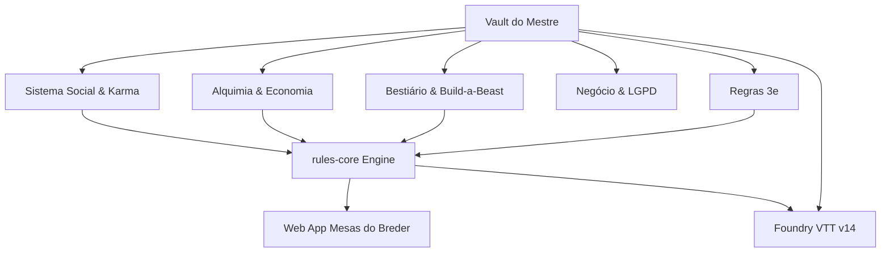

# 🌌 Vault do Mestre — Mighty Blade 3ª Edição & VTT Ecosystem
### Map of Content (MOC) & Base de Conhecimento Central

Bem-vindo ao segundo cérebro digital do projeto **Mesas do Breder** e do ecossistema de desenvolvimento de **Mighty Blade 3e**. Esta base foi estruturada para ser aberta diretamente no **Obsidian**, aproveitando o grafo de conexões, backlinks automáticos e navegação fluida.

---

## 🗺️ Mapa de Conteúdo (MOC)

### 1. ⚔️ Regras & Mecânicas do Sistema
* [[regras-mb3e]] — Resumo das mecânicas fundamentais (Atributos, Carga, Vida, Mana, Combate e Progressão de Nível 1 a 5).
* [[contrato-json-canonico]] — Especificação canônica do schema JSON v1.0 para fichas de personagens, efeitos e condições.
* [[glossario]] — Glossário unificado de termos técnicos, perícias, manobras e estados de combate.
* [[resumo-rules-core]] — Arquitetura determinística do motor `@mighty-blade/rules-core` (122 testes unitários com Vitest).

---

### 2. 🐉 Bestiário & Criação de Criaturas (Codex Monstrorum)
* [[compendio-bestas-codex]] — Compêndio unificado de todas as **93 bestas e variações** das páginas 18 a 144 do *Codex Monstrorum*.
* [[motor-build-a-beast]] — O motor matemático de anatomia de monstros (**Build-a-Beast / Homebrew Generator**), fórmulas de tamanho (Miúdo a Colossal) e prompt oficial de IA.

---

### 3. 🧪 Alquimia, Forja & Economia
* [[alquimia-e-crafting]] — Guia dos 27 ingredientes canônicos, 35 poções, os 6 processos de refino (Tisana a Calcinação) e o Ateliê de Crafting Witcher-style.
* **Economia Tebryniana:** Padrão monetário de moedas (`🪙`), Coroas de Ouro, Meias Coroas, Coroas de Prata e Cobre com dedução em tempo real.

---

### 4. 🎲 Foundry Virtual Tabletop (v14+)
* [[manual-do-sistema]] — **Manual Oficial do Sistema:** Fichas de heróis e NPCs, rolagens ($X\text{d6}$), defesas ativas, cálculo de carga e importador 1-clique do Web App.
* [[manual-tecnico]] — **Manual Técnico de Engenharia:** Arquitetura interna, DataModels tipados (`TypeDataModel`), pipeline de compêndios LevelDB (`ClassicLevel`), compilação SASS e guia de manutenção/releases.
* [[foundry-v14-architecture]] — Arquitetura de sistemas modernos para **Foundry VTT v14**, ciclo de vida de Sheets, automação de dados e empacotamento de LevelDB.
* Repositório oficial do sistema VTT: `https://github.com/Gbredo/mighty-blade-foundry-vtt`.

---

### 5. 📋 Backlog & Planejamento
* [[TODO]] — Backlog e roadmap priorizado: pastas de parties no dashboard, bússola moral/karma, alinhamento tático, afinidade, wikilinks bidirecionais e autocomplete popup fuzzy.

---

### 6. 🏛️ Arquitetura de Software, Algoritmos & Decisões de Código
* [[arquitetura-e-design-patterns]] — Arquitetura em 4 camadas, Single Language Stack (TypeScript ponta a ponta), Design Patterns aplicados (Builder, Strategy, Adapter, Observer) e por que usamos Python na ingestão de dados.
* [[decisoes-algoritmos-e-estruturas]] — Decisões de implementação e algoritmos com exemplos reduzidos, arquivos e linhas: estruturas de repetição (`.reduce()`, `for...of`, `while`), complexidade $O(1)$ com Hash Tables vs $O(N)$, e regex de NLP para sanitização de PDFs.

---

### 7. 💼 Estratégia de Negócio, Monetização & LGPD
* [[estrategia-de-negocio-e-lgpd]] — Registro de software e marca no INPI, conformidade com a LGPD (Lei nº 13.709/2018), modelo de monetização ética (Tier Free, Mestre Premium, "Faça Seu Jogo / Me Contrate") e proteção de propriedade intelectual.

---

### 8. 🤝 Sistema Social, Karma & Relacionamentos
* [[sistema-karma-relacionamentos]] — Arquitetura da Bússola Moral (-100 a +100), Matriz de Relacionamentos e Afinidade, prevenção de conflitos semânticos, gestão de Pastas de Parties e hiperlinks Markdown bidirecionais (`[[Nome]]`).

---

## 🔗 Grafo de Conexões Principais

