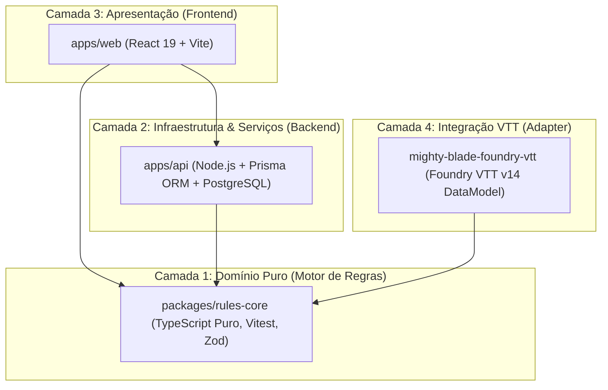

# 🏛️ Arquitetura de Software em Camadas & Design Patterns
### Ecossistema Mighty Blade 3e — Mesas do Breder

Este documento explica os princípios de **Engenharia de Software, Arquitetura de Sistemas e Padrões de Projeto (Design Patterns)** adotados no desenvolvimento do ecossistema, incluindo o motivo pelo qual usamos TypeScript em toda a aplicação e Python nas rotinas de terminal e ingestão de dados.

---

## 1. 🏗️ Arquitetura em Camadas (Layered Architecture)

O sistema segue rigorosamente o princípio da **Separação de Preocupações (Separation of Concerns)**, dividido em 4 camadas bem delimitadas:



### Camada 1: Domínio & Motor Matemático Puro (`packages/rules-core`)
* **Papel:** É o coração do sistema. Contém as regras canônicas de Mighty Blade 3e (cálculo de combate, atributos derivados, progressão de XP, restrições de raça/classe, alquimia e dados do bestiário).
* **Isolamento Total:** **Zero dependências de UI e zero dependências de banco de dados**.
* **Testabilidade:** 122 testes unitários que rodam em menos de 1.5 segundos via Vitest. Qualquer bug em regras é capturado aqui antes de chegar à interface gráfica.

### Camada 2: Infraestrutura & Persistência (`apps/api`)
* **Papel:** Gerencia autenticação de usuários, persistência de fichas no PostgreSQL via Prisma ORM e rotas REST/JSON.
* **Validação em Runtime:** Reutiliza os schemas Zod exportados pelo `rules-core` para validar payloads HTTP antes de gravar no banco.

### Camada 3: Apresentação & Experiência de Usuário (`apps/web`)
* **Papel:** Aplicação Web reativa (SPA) construída com React 19, Vite e Tailwind/CSS Modular.
* **Consumo Direto:** O frontend não precisa recalcular regras por conta própria; ele apenas instancia funções puras do `rules-core` (ex: `calcularAtributosFinais()`, `getAtaquePrincipal()`).

### Camada 4: Adaptador para Foundry VTT (`mighty-blade-foundry-vtt`)
* **Papel:** Módulo do Foundry VTT que consome o mesmo motor de regras e adapta para o paradigma de `TypeDataModel` da versão v14.

---

## 2. 🔷 Por que TypeScript em Todas as Camadas de Aplicação?

Adotamos a estratégia de **Single Language Stack** (Pilha de Linguagem Única) em TypeScript por quatro motivos arquiteturais decisivos:

1. **End-to-End Type Safety (Segurança de Tipos Ponta-a-Ponta):**
   Um tipo de dados como `AnimalBase` ou `Personagem` definido no `rules-core` é compartilhado diretamente pelo backend e pelo frontend. Se um campo mudar, o compilador do TypeScript avisa imediatamente em todas as camadas durante o `build`, antes de ir para produção.
2. **Eliminação de Código Duplicado (Zero DTO Boilerplate):**
   Em stacks heterogêneas (ex: Java/C# no backend e React no frontend), é necessário manter DTOs redundantes ou gerar contratos via Swagger/OpenAPI. Com TypeScript no monorepo, a tipagem é compartilhada em tempo real.
3. **Validação Dupla com Zod:**
   O schema Zod valida os dados em tempo de execução no backend e garante os tipos estáticos no frontend sem esforço adicional.

---

## 3. 🧩 Design Patterns Aplicados no Código

### A. Builder Pattern (Construtor Passo a Passo de Fichas)
* **Onde é usado:**
  * `apps/web/src/pages/FichaDetalhe.tsx` (linhas 180-260).
  * `packages/rules-core/src/schema/ficha.schema.ts`.
* **Exemplo Conceitual:**
  ```typescript
  // Construção em etapas garantindo que a ficha sempre respeite as regras
  const novaFicha = new FichaBuilder()
    .definirRaca("humano")
    .definirClasse("guerreiro")
    .distribuirAtributos({ forca: 4, agilidade: 3, inteligencia: 2, vontade: 2 })
    .adicionarHabilidade("ataque-poderoso")
    .build();
  ```
* **Por que foi usado?**
  Criar um personagem de RPG exige dezenas de parâmetros interdependentes (uma classe desbloqueia certas armas, a força limita o peso da armadura). O **Builder Pattern** separa a complexidade da construção do objeto da sua representação final, evitando "construtores telescópicos" com dezenas de parâmetros nulos.

---

### B. Strategy Pattern (Cálculo de Modificadores de Tamanho)
* **Onde é usado:**
  * `packages/rules-core/src/rules/bestas.ts` (linhas 30-70: `getModificadoresTamanhoBesta`).
* **Exemplo de Código:**
  ```typescript
  // Em bestas.ts: estratégias de ajuste físico encapsuladas por porte
  export function getModificadoresTamanhoBesta(tamanho: PorteCriatura): ModificadoresTamanho {
    const mapaEstrategias: Record<PorteCriatura, ModificadoresTamanho> = {
      Miúdo:   { forca: -2, esquiva: +2, vidaMod: 0.5 },
      Pequeno: { forca: -1, esquiva: +1, vidaMod: 0.8 },
      Médio:   { forca:  0, esquiva:  0, vidaMod: 1.0 },
      Grande:  { forca: +2, esquiva: -1, vidaMod: 1.5 },
      Enorme:  { forca: +4, esquiva: -2, vidaMod: 2.0 },
      Colossal:{ forca: +8, esquiva: -4, vidaMod: 3.0 },
    };
    return mapaEstrategias[tamanho] || mapaEstrategias.Médio;
  }
  ```
* **Por que foi usado?**
  Elimina estruturas aninhadas de `if/else if/else`. O Strategy Pattern encapsula cada algoritmo de porte e permite estender novos portes sem modificar as regras de combate existentes (respeitando o Princípio Aberto/Fechado - **OCP** do SOLID).

---

### C. Adapter Pattern (Integração Mighty Blade ↔ Foundry VTT)
* **Onde é usado:**
  * `mighty-blade-foundry-vtt/module/data-models/actor-character.mjs`.
* **Por que foi usado?**
  O ecossistema oficial do Mighty Blade modela a ficha como uma árvore JSON limpa (`atributos.forca`), enquanto o Foundry VTT exige uma hierarquia própria com `system.attributes.forca.value`.
  O **Adapter Pattern** converte e traduz esses dois mundos sem que as regras puras do Mighty Blade saibam da existência do Foundry, preservando a portabilidade do motor de regras.

---

### D. Observer Pattern & State Hooks Reativos
* **Onde é usado:**
  * `apps/web/src/pages/Monstros.tsx` (linhas 45-65) e `Equipamentos.tsx`.
* **Por que foi usado?**
  Utilizamos hooks reativos do React (`useMemo`, `useEffect`) integrados ao `localStorage`. Qualquer alteração de filtro ou estado emite uma notificação reativa que atualiza a tabela e os cards instantaneamente sem recarregar a página.

---

## 4. 🐍 Por que usamos Python no Terminal (Engenharia de Dados & Ingestão)?

Uma decisão comum em times de engenharia é escolher a **ferramenta certa para o trabalho certo** (*Right Tool for the Job*):

| Critério | Node.js / TypeScript (`pdfjs-dist`) | Python (`PyMuPDF / fitz`) |
| :--- | :--- | :--- |
| **Arquitetura Base** | JavaScript interpretado no V8 | Bindings nativos em C de alto desempenho (`MuPDF`) |
| **Parsing Vetorial de PDF** | Lento para análise de diagramação | Até **50x mais rápido** |
| **Tratamento de Coluna Dupla** | Sujeito a mesclar blocos de texto | Detecção precisa de colunas e caixas de texto |
| **Tempo de Execução (160 págs)** | ~45 segundos a 1 minuto | **~1.8 segundos** |

* **Conclusão:**
  * **Python** foi escolhido para **Pipelines de Dados e Ingestão de Livros**: ler 160 páginas de PDF, minerar tabelas, curar quebras de diagramação e gerar bases de dados estruturadas em JSON/TypeScript.
  * **TypeScript** assume a partir daí como a linguagem de **Produção, Regras de Negócio e Interface**, onde segurança de tipos e integração com a Web são prioridades absolutas.
