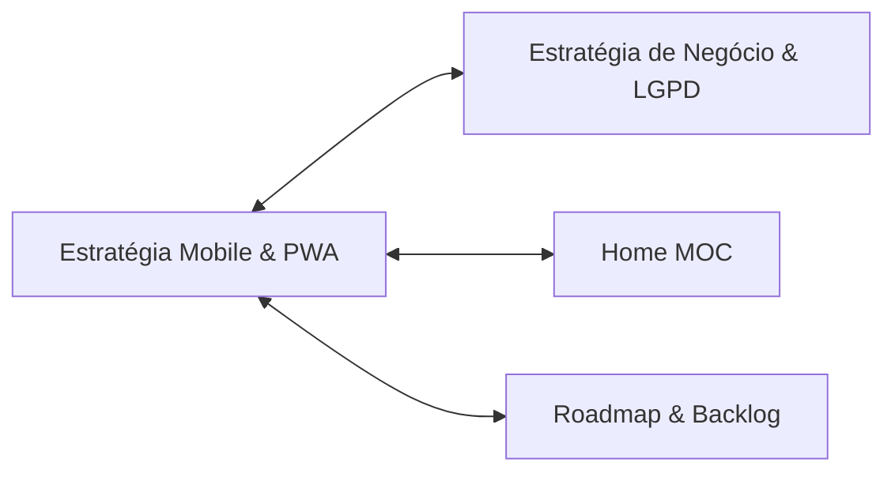

# 📱 Estratégia Mobile: PWA, Android (Google Play) & iOS
### Diretrizes Técnicas, Financeiras e Educacionais para o Ecossistema Mesas do Breder

> [!NOTE]
> Este documento consolida a decisão estratégica do **Item 2/33 do Excalidraw**, alinhando a viabilidade técnica de distribuição móvel, os custos reais de lojas e a sinergia com os estudos de Ciência da Computação / Sistemas de Informação na PUC.
> * Visão de Negócio & LGPD: [[estrategia-de-negocio-e-lgpd]]
> * MOC Central do Vault: [[Home]]
> * Backlog do Projeto: [[TODO]]

---

## 1. ⚖️ Diagnóstico Comparativo de Lojas Móveis

A distribuição em lojas de aplicativos impõe realidades financeiras e burocráticas muito distintas:

| Dimensão | Google Play Store (Android) | Apple App Store (iOS) |
| :--- | :--- | :--- |
| **Taxa de Cadastro** | **US$ 25 (~R$ 140)** única e vitalícia. | **US$ 99 (~R$ 550)** recorrente **todo ano**. |
| **Hardware Necessário** | Qualquer PC Windows ou Linux compila o projeto no Android Studio. | Exige máquina física com **macOS (MacBook ou Mac Mini)** e Xcode para assinar e compilar o app. |
| **Burocracia & Validação** | Exige teste fechado prévio com 20 testadores por 14 dias para contas de desenvolvedor pessoal recentes. | Revisão humana estrita que frequentemente rejeita webviews ou exige que o app justifique recursos nativos do aparelho. |
| **Decisão Estratégica** | 🟢 **Aprovado para Publicação.** Investimento único viável que agrega valor imediato ao portfólio. | 🟡 **Congelado no Backlog.** Não faz sentido queimar R$ 550 anuais sem modelo de receita consolidado. |

---

## 2. 🏗️ Arquitetura Técnica: Evitando a Armadilha da Duplicação

O ecossistema **Mighty Blade 3e Website** já conta com uma base sólida em **React 18 + TypeScript**, com motor `@mighty-blade/rules-core` 100% determinístico e 122 testes unitários.

> [!WARNING]
> **Anti-Pattern Evitado:** Reescrever o sistema inteiro em Kotlin nativo para Android duplicaria a base de código, exigiria reescrever toda a matemática de combate, árvores de habilidades e 373 equipamentos, gerando um custo duplo de manutenção para cada patch.

### A. Solução Fase 1 (Imediata — Custo R$ 0): Progressive Web App (PWA)
* Adição de `manifest.json`, ícones em múltiplos tamanhos e Service Worker para cache local.
* **Experiência do Usuário:** Botão nativo **"Instalar Aplicativo"** no navegador. O app ganha ícone na tela inicial, abre em tela cheia (sem barra de URL) e roda offline.
* **Suporte Completo a iOS:** Usuários de iPhone acessam pelo Safari e clicam em *"Compartilhar $\rightarrow$ Adicionar à Tela de Início"*, tendo a mesma experiência de um app nativo sem pagar taxa de desenvolvedor da Apple.

### B. Solução Fase 2 (Loja Oficial): Empacotamento com Capacitor ou TWA
* Utilizar **Capacitor** (`@capacitor/core`, `@capacitor/android`) ou **Trusted Web Activity (TWA)**.
* O comando `npx cap add android` gera um projeto Android oficial com estrutura **Gradle / Kotlin** que abre diretamente no **Android Studio**.
* O binário `.aab` (Android App Bundle) é gerado para upload na Google Play Console, mantendo a camada de regras sincronizada com o website.

---

## 3. 🎓 Sinergia Educacional com a PUC (Estudos em Kotlin)

A introdução ao Kotlin e Android Studio na faculdade não deve se misturar com o estresse de tentar recriar este ecossistema gigante do zero. A recomendação acadêmica e profissional é:

1. **Nas Disciplinas da PUC:** Desenvolver pequenos aplicativos utilitários 100% nativos em Kotlin focados nas diretrizes do professor:
   * **MB Dice Roller:** Aplicativo nativo em Kotlin para rolagem de dados $X\text{d6}$ com cálculo de explosões e histórico.
   * **Calculadora de Carga & Recursos:** Activity em Kotlin com sliders de atributos e barras de PV/PM.
2. **No Portfólio Geral:** Demonstrar domínio de **Arquitetura Híbrida de Software** — saber quando usar código nativo (Kotlin) e quando usar monorepo TypeScript para economizar meses de trabalho empresarial.

---

## 4. 📢 Posicionamento Oficial perante a Comunidade

No Roadmap e nos canais sociais da plataforma, a comunicação oficial será transparente e profissional:

* **Para a Comunidade Android:**
  > *"Em desenvolvimento: Disponibilização em breve na Google Play Store via empacotamento oficial, além do suporte instantâneo como PWA no navegador."*
* **Para a Comunidade iOS (Apple):**
  > *"Acesso imediato no iPhone e iPad adicionando o site à Tela de Início (modo PWA nativo com suporte offline). O aplicativo dedicado na App Store está mapeado no backlog para quando o projeto atingir sustentabilidade financeira com o Mestre Premium."*

---

## 5. 🗺️ Navegação Bidirecional de Documentos

* Ver Diretrizes Comerciais: [[estrategia-de-negocio-e-lgpd]]
* Voltar ao Início: [[Home]]
