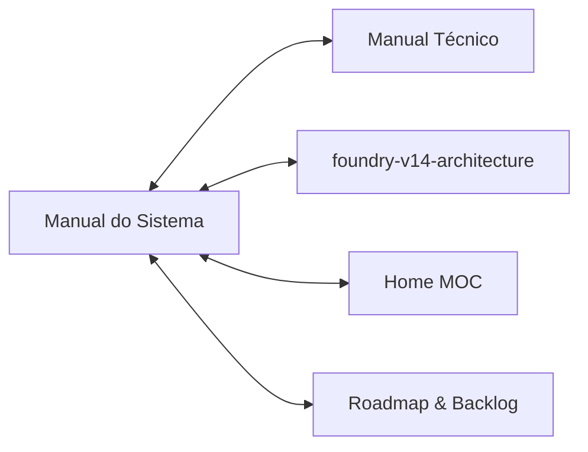

# 🎲 Manual do Sistema — Mighty Blade 3.5 para Foundry VTT (v14+)
### Guia Oficial de Regras, Fichas, Automações e Operação em Mesa Virtual

> [!NOTE]
> Este manual foi estruturado com sintaxe de **Obsidian Bases** (YAML Frontmatter com tipagem formal) e conexões bidirecionais (`[[...]]`) para integração nativa tanto no cofre do mestre quanto na documentação oficial do repositório.
> * Documento Técnico de Manutenção: [[manual-tecnico]]
> * Arquitetura de Sistemas v14: [[foundry-v14-architecture]]
> * Índice Geral do Cofre: [[Home]]
> * Backlog do Projeto: [[TODO]]

---

## 1. ⚔️ Visão Geral do Sistema no Foundry VTT

O sistema **Mighty Blade 3.5** para o **Foundry Virtual Tabletop (v14+)** é uma implementação cinematográfica, reativa e 100% canônica das regras da 3ª Edição Revisada do RPG brasileiro *Mighty Blade* (criado por Tiago Junges / Coisinha Verde).

O sistema foi desenhado para eliminar a fricção mecânica do mestre e dos jogadores:
1. **Atributos & Dados**: Automação nativa da rolagem de dados $X\text{d6}$ baseada nos quatro atributos centrais (**Força**, **Agilidade**, **Inteligência**, **Vontade**).
2. **Defesas Ativas Triplas**: Cálculo automático das três defesas canônicas — **Bloqueio** ($\text{Força} + \text{Bônus de Escudo/Habilidade}$), **Esquiva** ($\text{Agilidade} + \text{Armadura/Habilidade}$) e **Determinação** ($\text{Vontade} + \text{Habilidade}$).
3. **Economia de Recursos & Tokens**: Sincronização em tempo real das barras de **Pontos de Vida (PV)** e **Pontos de Mana (PM)** com os tokens do mapa tático.
4. **Carga e Equipamento**: Cálculo instantâneo de **Carga Básica** ($\text{Força} \times 5\text{ kg}$) e **Carga Máxima** ($\text{Força} \times 10\text{ kg}$) com penalidades automáticas de sobrecarga.
5. **Automação de Raças e Classes**: Ao arrastar uma Raça ou Classe de um compêndio para uma ficha, o sistema aplica automaticamente as concessões de atributos, habilidades raciais e bônus de classe!

---

## 2. 🧙 Tipos de Atores (Actors)

O sistema possui dois tipos primários de atores, registrados via DataModels formais:

```
                  ┌────────────────────────────────────────┐
                  │          MightyBladeActor              │
                  └──────────────────┬─────────────────────┘
                                     │
                    ┌────────────────┴────────────────┐
                    ▼                                 ▼
         ┌─────────────────────┐           ┌─────────────────────┐
         │      character      │           │         npc         │
         │  (Heróis de Jogador) │           │ (Monstros / Bestas) │
         └─────────────────────┘           └─────────────────────┘
```

### A. Personagem (`character`)
* **Uso:** Ficha completa para jogadores e heróis de campanha.
* **Recursos Iniciais:** 60 PV e 60 PM (padrão canônico de regras).
* **Nível & XP:** Progressão do Nível 1 ao 5 com tracking de experiência acumulada.
* **Detalhes Sociais:** Dinheiro em Coroas de Ouro (`dinheiro`), Antecedente, Aprendiz, Caminho, Idiomas, Motivação, Condição e lista de Aflições ativas.
* **Subatributos Derivados:**
  * **Iniciativa Canônica:** $2\text{d6} + \max(\text{Agilidade}, \text{Inteligência})$.
  * **Deslocamento & Corrida:** Calculados a partir de Agilidade e efeitos de armaduras.
  * **Carga Atual:** Soma dos pesos dos itens equipados comparada à Carga Máxima.

### B. Criatura / Monstro (`npc`)
* **Uso:** Ameaças do *Codex Monstrorum*, animais do *Monstrum Codex*, bandidos e figuras secundárias.
* **Estrutura Enxuta:** Focada em combate ágil pelo mestre (Atributos brutos, PV/PM configuráveis, Ameaça/Nível, Bônus de Defesa e lista de ataques).

---

## 3. 📦 Tipos de Itens (Items) e Compêndios (Packs)

No Foundry VTT, tudo o que não é um ator é um **Item Document**. O Mighty Blade 3.5 suporta 9 tipos de itens:

| Tipo de Item | Ícone Padrão | Descrição & Comportamento |
| :--- | :---: | :--- |
| `raca` | 🧝 | Raça do personagem. Possui bônus de atributos e habilidade automática embutida. Ao ser dropada, dispara a escolha de concessões. |
| `classe` | ⚔️ | Classe de herói (Básica ou Avançada). Define vida/mana base, armas permitidas e habilidades iniciais. |
| `habilidade` | ⚡ | Habilidade ativa, suporte ou reação. Possui custo de PM, tipo de ação e array declarativo de `efeitos[]`. |
| `magia` | ✨ | Feitiço arcano, divino ou elemental com custo de Mana, alcance, duração e fórmula de dano/cura. |
| `arma` | 🗡️ | Arma de combate (Corpo a Corpo, À Distância, Haste). Define dano ($X\text{d6}$), alcance e se é empunhada em 1 ou 2 mãos. |
| `armadura` | 🛡️ | Proteção corporal. Concede Redução de Dano (RD) ou bônus de Esquiva/Bloqueio e aplica penalidade de carga/deslocamento. |
| `equipamento` | 🎒 | Itens mundanos, tochas, cordas, rações, ferramentas e artefatos. Possui peso, quantidade e valor em coroas. |
| `idioma` | 🗣️ | Idiomas conhecidos pelo personagem (Comum, Anão, Élfico, Drakoniano, etc.). |
| `item` | 📦 | Item genérico para itens rápidos criados na hora pelo mestre. |

### Os 5 Compêndios Canônicos (Packs LevelDB)
O sistema já vem empacotado de fábrica com **mais de 1.000 registros canônicos** prontos para uso:
* `packs/racas`: Todas as 21 raças canônicas com suas concessões.
* `packs/classes`: Classes de combate, magia e ladinagem.
* `packs/habilidades`: Habilidades de classe, caminho e organizações.
* `packs/magias`: Grimório completo de magias de 1º a 5º círculo.
* `packs/equipamentos`: 373 equipamentos canônicos (armas, armaduras, escudos e mundanos).

---

## 4. 🎲 Rolagens de Dados e Mecânicas de Teste

### A. Fórmulas de Rolagem no Chat
Todas as rolagens no Mighty Blade usam dados de 6 faces ($d6$):
* **Teste de Atributo Puro:** Rola $N\text{d6}$, onde $N$ é o valor do atributo (ex: Força 3 rola `3d6`).
  * O jogador clica no nome do atributo na ficha para disparar o teste com opções de bônus/penalidade.
* **Teste Oposto / Desafio:** O resultado total é somado e comparado à Dificuldade ou à Defesa do alvo.

### B. Fórmula de Iniciativa
A iniciativa do Mighty Blade 3.5 é configurada globalmente no sistema como:
$$\text{Iniciativa} = 2\text{d6} + \max(\text{Agilidade}, \text{Inteligência})$$
Ao clicar no ícone de dados do Combat Tracker do Foundry, essa rolagem é executada e os turnos são ordenados automaticamente.

### C. Fórmulas de Combate & Ataque
1. **Ataque Físico:** Rola $N\text{d6}$ do atributo de ataque (Força para armas pesadas, Agilidade para armas leves/distância).
2. **Defesa do Alvo:** O atacante precisa igualar ou superar a Defesa ativa escolhida pelo defensor:
   * **Bloqueio:** Usado contra ataques físicos se o defensor tiver escudo ou arma adequada.
   * **Esquiva:** Usada para se esquivar de flechas e ataques de área.
   * **Determinação:** Usada contra magias mentais, medo e coerção.
3. **Dano e Redução de Dano (RD):** Se o ataque acertar, rola-se o dano da arma ($X\text{d6}$). O dano final aplicado aos Pontos de Vida é:
   $$\text{Dano Sofrido} = \max(0, \text{Dano Rolado} - \text{RD da Armadura})$$

---

## 5. ⚡ Importação 1-Clique do Gerador Web

Para mestres e jogadores que criam personagens no nosso Companion Web (`MightyBlade3eWebsite`), o sistema do Foundry possui um importador direto:

1. No Web App, clique em **Exportar Ficha** $\rightarrow$ **JSON Canônico (v1.0)** $\rightarrow$ **Copiar**.
2. No Foundry VTT, abra a aba **Actors** (Atores).
3. No topo da barra, clique no botão **[ 📥 Importar Ficha ]**.
4. Cole o JSON canônico na caixa de diálogo e clique em **Confirmar**.
5. **Pronto!** O Foundry cria o Ator, injeta os atributos, vincula as habilidades correspondentes dos Compêndios canônicos e configura os tokens automaticamente, sem disparar janelas repetitivas de concessão!

---

## 6. 🗺️ Navegação Bidirecional de Documentos



* Próximo: [[manual-tecnico]] — Entenda como o código-fonte, DataModels e LevelDB funcionam por baixo do capô.
* Voltar ao Início: [[Home]]
