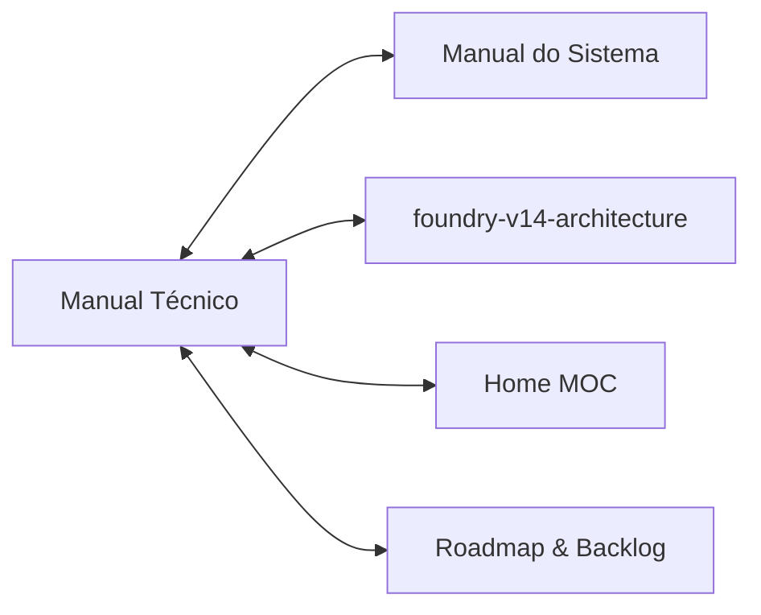

# 🛠️ Manual Técnico de Engenharia & Manutenção — Foundry VTT (v14+)
### Guia de Sobrevivência e Arquitetura de Código para o Mantenedor

> [!IMPORTANT]
> Este documento foi redigido com **nível cirúrgico de detalhamento técnico** para garantir a independência e autonomia do mantenedor (**Guilherme Breder**). Caso você precise dar manutenção, corrigir bugs ou expandir o sistema sem auxílio externo, todas as respostas estão estruturadas aqui.
> * Manual de Uso & Regras do Sistema: [[manual-do-sistema]]
> * Arquitetura de Sistemas v14: [[foundry-v14-architecture]]
> * MOC Central do Vault: [[Home]]
> * Backlog do Projeto: [[TODO]]

---

## 1. 📁 Anatomia do Repositório (`mighty-blade-foundry-vtt`)

Abaixo está o mapa completo de arquivos e suas responsabilidades vitais no sistema:

```text
mighty-blade-foundry-vtt/
├── system.json                    # Manifesto oficial do sistema lido pelo Foundry v14
├── template.json                  # Estrutura legada de Actor/Item (usada como fallback de DataModels)
├── package.json                   # Scripts npm (compilação SASS, empacotamento LevelDB)
├── module/                        # Código-fonte ES Modules (.mjs)
│   ├── mighty-blade.mjs          # Ponto de entrada (Entrypoint) e registro de Hooks centrais
│   ├── data/                      # Modelos de Dados Tipados (foundry.abstract.TypeDataModel)
│   │   ├── actor-character.mjs    # DataModel da Ficha de Personagem (cálculo de carga, defesas, atributos)
│   │   └── actor-npc.mjs          # DataModel de Monstros e PDMs
│   ├── documents/                 # Extensões dos Documentos do Foundry
│   │   ├── actor.mjs              # MightyBladeActor (rolagens, concessões raciais, suppressConcessoes)
│   │   └── item.mjs               # MightyBladeItem (dados de armas, magias, armaduras)
│   ├── sheets/                    # Controladores de Interface de Usuário
│   │   ├── actor-sheet.mjs        # MightyBladeActorSheet (Handlebars, listeners de clique, abas)
│   │   └── item-sheet.mjs         # MightyBladeItemSheet (edição de itens, efeitos e propriedades)
│   └── helpers/                   # Utilitários, scripts auxiliares e regras canônicas
│       ├── config.mjs             # Constantes globais (CONFIG.MIGHTY_BLADE: raças, classes, perícias)
│       ├── dice.mjs               # API de rolagem (rollTest, rollAttribute, castSpell)
│       ├── import.mjs             # Importador de JSON canônico v1.0 do Web App
│       ├── concessoes.mjs         # Lógica de concessões automáticas (escolhas de bônus raciais)
│       └── templates.mjs          # Preload assíncrono de templates parciais Handlebars
├── packs/                         # Compêndios binários em formato ClassicLevel (LevelDB)
│   ├── racas/                     # 21 raças canônicas
│   ├── classes/                   # Classes de combate, magia e ladinagem
│   ├── habilidades/               # Habilidades de classe, caminho e organizações
│   ├── magias/                    # Grimório completo de magias
│   └── equipamentos/              # 373 armas, armaduras e equipamentos mundanos
├── scripts/                       # Scripts Node.js para compilar e empacotar dados
│   ├── import_all.mjs             # Orquestrador mestre de empacotamento dos 5 compêndios
│   ├── import_racas.mjs           # Gera o pack de Raças no LevelDB
│   ├── import_classes.mjs         # Gera o pack de Classes no LevelDB
│   ├── import_habilidades_e_magias.mjs # Gera Habilidades e Magias
│   └── import_equipamentos.mjs    # Gera Equipamentos canônicos
├── src/scss/                      # Código-fonte dos estilos (SASS)
│   └── mighty-blade.scss          # Folha de estilos compilada para css/mighty-blade.css
├── templates/                     # Templates Handlebars (.hbs) para Atores e Itens
│   ├── actor/                     # Partials da ficha (header, combate, inventario, magia)
│   └── item/                      # Templates de edição de itens
└── lang/                          # Localização e i18n (en.json, pt-BR.json)
```

---

## 2. 📜 O Manifesto do Sistema (`system.json`)

O `system.json` é a certidão de nascimento do sistema para o Foundry. Nele residem as configurações críticas:

```json
{
  "id": "mighty-blade",
  "title": "Mighty Blade 3.5",
  "version": "1.0.0",
  "compatibility": {
    "minimum": 14,
    "verified": "14.359"
  },
  "esmodules": ["module/mighty-blade.mjs"],
  "styles": ["css/mighty-blade.css"],
  "packs": [
    { "name": "racas",        "type": "Item", "path": "packs/racas",        "system": "mighty-blade" },
    { "name": "classes",      "type": "Item", "path": "packs/classes",      "system": "mighty-blade" },
    { "name": "habilidades",  "type": "Item", "path": "packs/habilidades",  "system": "mighty-blade" },
    { "name": "magias",       "type": "Item", "path": "packs/magias",       "system": "mighty-blade" },
    { "name": "equipamentos", "type": "Item", "path": "packs/equipamentos", "system": "mighty-blade" }
  ],
  "primaryTokenAttribute": "resources.vida",
  "secondaryTokenAttribute": "resources.mana"
}
```

> [!WARNING]
> Nunca altere o `"id": "mighty-blade"` após mundos terem sido criados! O Foundry usa esse ID como chave estrangeira em todas as instâncias de mundos e compêndios. Alterar o ID corromperá a inicialização dos mundos existentes.

---

## 3. 🧠 Ciclo de Vida e DataModels Tipados (v14+)

### A. O Ciclo de Inicialização (`module/mighty-blade.mjs`)
Ao carregar um mundo no Foundry v14, o hook `init` é disparado uma única vez:
1. Registra `game.mightyBlade` com as ferramentas utilitárias (`MightyBladeActor`, `MightyBladeItem`, `rollTest`, `importCharacterFromJSON`).
2. Configura a fórmula global de iniciativa: `CONFIG.Combat.initiative = { formula: "2d6 + @init", decimals: 0 }`.
3. Registra os DataModels:
   ```javascript
   CONFIG.Actor.dataModels = {
     character: MightyBladeCharacterData,
     npc: MightyBladeNpcData,
   };
   ```
4. Vincula as classes de documento (`CONFIG.Actor.documentClass = MightyBladeActor`).
5. Registra as Sheets Handlebars padrão e faz o preload dos templates parciais.
6. O hook `renderActorDirectory` injeta o botão **[ 📥 Importar Ficha ]** no topo da lista de atores.

---

### B. O Motor de Dados do Personagem (`module/data/actor-character.mjs`)
O `MightyBladeCharacterData` estende `foundry.abstract.TypeDataModel`.
Ele divide os dados em:
* **Dados Persistidos no Banco:** Valores `base` de atributos (Força, Agilidade, Inteligência, Vontade), Nível, XP, Dinheiro e Aflições.
* **Dados Derivados em Runtime (`prepareDerivedData()`):**
  1. `_prepareEfeitos()`: Varre os itens equipados procurando o array declarativo `system.efeitos[]` (ex: `bonusAtributo`, `bonusDefesa`, `bonusDeslocamento`, `cargaComoForca`).
  2. `_prepareAttributes()`: Soma os bônus aos atributos base:
     $$\text{Atributo Final} = \text{base} + \text{bônus de efeitos}$$
  3. `_prepareEquipamento()`: Soma o peso de todos os itens e calcula a Redução de Dano (RD) total de armaduras.
  4. `_prepareDefesas()`:
     * $\text{Bloqueio} = \text{Força} + \text{Bônus de Escudo/Itens}$
     * $\text{Esquiva} = \text{Agilidade} + \text{Armadura/Itens}$
     * $\text{Determinação} = \text{Vontade} + \text{Bônus de Itens}$
  5. `_prepareSubattributes()`:
     * $\text{Carga Básica} = \text{Força Final} \times 5\text{ kg}$
     * $\text{Carga Máxima} = \text{Força Final} \times 10\text{ kg}$
     * $\text{Iniciativa} = \max(\text{Agilidade Final}, \text{Inteligência Final})$

---

### C. Concessões Automáticas no Ator (`module/documents/actor.mjs`)
Quando um jogador arrasta uma Raça ou Classe para a ficha:
* O hook `_onCreateEmbeddedDocuments` detecta a inserção do Item.
* Se for `raca`: dispara `_processConcessoes(race, "sourceRaceId")`. Se a raça exigir escolha (como Humano escolhendo +1 em um atributo), abre um diálogo interativo para o jogador.
* Se for `classe`: injeta as habilidades automáticas de classe.
* Ao deletar a raça/classe (`_onDeleteEmbeddedDocuments`), o sistema remove cirurgicamente os bônus e itens vinculados por aquele ID de origem.
* **Modo Silencioso (`_suppressConcessoes = true`):** Usado durante a importação de JSON do site para evitar abrir popups de concessão para uma ficha que já veio completa!

---

## 4. 📦 Pipeline de Build e Compilação dos Compêndios (LevelDB)

O Foundry v14 utiliza **ClassicLevel** (LevelDB) para armazenamento ultrarrápido de compêndios binários.
Para não editar arquivos binários na mão, nós temos scripts automatizados em `scripts/`:

```
+------------------------------------+
|  rules-core (Dados Canônicos JSON) |
+------------------┬-----------------+
                   │
                   ▼
+------------------------------------+
|  scripts/import_all.mjs            |
|  ├── import_racas.mjs              |
|  ├── import_classes.mjs            |
|  ├── import_habilidades_e_magias   |
|  └── import_equipamentos.mjs       |
+------------------┬-----------------+
                   │  ClassicLevel API
                   ▼
+------------------------------------+
|  packs/ (Bancos Binários LevelDB)  |
|  ├── packs/racas/                  |
|  ├── packs/classes/                |
|  ├── packs/habilidades/            |
|  ├── packs/magias/                 |
|  └── packs/equipamentos/           |
+------------------------------------+
```

### Como Reconstruir os Compêndios
Para atualizar todos os compêndios a partir dos dados do projeto:
```bash
# Na raiz do repositório mighty-blade-foundry-vtt:
npm run build:packs
```
Ou individualmente:
* `npm run build:racas` — Reconstrói apenas o pack de Raças.
* `npm run build:classes` — Reconstrói apenas o pack de Classes.
* `npm run build:habilidades` — Reconstrói Habilidades e Magias.
* `npm run build:equipamentos` — Reconstrói os 373 equipamentos canônicos.

---

## 5. 🎨 Compilação de Estilos (SASS)

Os estilos da ficha e janelas do sistema são escritos em SASS (`src/scss/mighty-blade.scss`):
```bash
# Compilação única para produção:
npm run build

# Modo observador (recompila a cada salvamento durante desenvolvimento):
npm run build:watch
```
O resultado é gerado em `css/mighty-blade.css`, que é o arquivo lido pelo Foundry.

---

## 6. 🧪 Como Instalar e Testar Localmente no Foundry v14

Para testar suas alterações no Foundry instalado na sua máquina:

1. Localize a pasta de dados do Foundry (geralmente em `%localappdata%/FoundryVTT/Data/systems/` no Windows).
2. Crie uma junção de diretório (link simbólico) ou copie a pasta:
   ```powershell
   cmd /c mklink /J "%localappdata%\FoundryVTT\Data\systems\mighty-blade" "D:\Projetos\mighty-blade-foundry-vtt"
   ```
3. Abra o Foundry VTT, vá em **Game Systems** e confirme que **Mighty Blade 3.5** aparece na lista.
4. Crie um novo mundo com o sistema **Mighty Blade 3.5** e inicie o servidor.
5. **Console de Depuração:** Abra o console do navegador no Foundry com `F12`.
   * Teste se o sistema carregou: digite `game.mightyBlade` no console.
   * Dispare um teste de rolagem manual: `game.mightyBlade.rollTest({ actor: _token.actor, atributo: "forca" })`.

---

## 7. 🚀 Checklist para Publicar Novas Versões (Releases)

Sempre que concluir um lote de melhorias:
1. Atualize a `"version"` em `package.json` e em `system.json` (ex: de `1.0.0` para `1.0.1`).
2. Adicione o resumo no `CHANGELOG.md`.
3. Garanta que os compêndios foram recompilados com `npm run build:packs`.
4. Garanta que o CSS foi compilado com `npm run build`.
5. Faça o commit e envie para o GitHub:
   ```bash
   git add .
   git commit -m "feat: [descrição da melhoria]"
   git push origin main
   ```
6. No GitHub, crie uma **Release** com a tag correspondente (ex: `v1.0.1`). O Foundry baixará automaticamente as atualizações pelo manifesto `https://raw.githubusercontent.com/Gbredo/mighty-blade-foundry-vtt/main/system.json`.

---

## 8. 🗺️ Navegação Bidirecional de Documentos



* Retornar ao: [[manual-do-sistema]]
* Visão Geral da Arquitetura: [[foundry-v14-architecture]]
* Voltar ao Início: [[Home]]
